# PyAutoLens Visual Workbench

[简体中文](README.zh-CN.md) | **English**

An independent community visual workbench powered by [PyAutoLens](https://github.com/PyAutoLabs/PyAutoLens). Explore strong gravitational lensing in 3D, change physical parameters, compute scientific images, and export native numerical data from a desktop browser.

Developed and maintained by [SiriusFzh](https://github.com/SiriusFzh). Supports **macOS and Windows**, with a **Chinese / English interface**. Python performs the scientific calculations locally and serves results over localhost.

> PyAutoLens supplies the lens-physics engine. Credit for PyAutoLens and its scientific methods belongs to the upstream developers.
>
> **Listed in the official PyAutoLens community directory.** On 7 October 2026, PyAutoLabs added this workbench to its [Community contributions page](https://github.com/PyAutoLabs/PyAutoLens/blob/main/docs/general/community.md) as a teaching and forward-simulation tool. The [maintainer's reply](https://github.com/orgs/PyAutoLabs/discussions/32#discussioncomment-18793010) confirms the listing after a review of the repository's code, packaging and licensing.
>
> The workbench remains independently maintained by SiriusFzh. As the community page states, listed projects are not endorsed, tested or supported by PyAutoLabs; inclusion is not software certification or integration into the upstream application.

## What can you do with it?

Explore how changing a lens mass distribution, source position, or observing condition changes the resulting image. The workbench is useful for classroom demonstrations, learning strong lensing, exploring configurations, and inspecting forward models before writing analysis scripts.

| Workspace | Tasks |
| --- | --- |
| 3D geometry | Rotate a thin-lens teaching scene, drag the source, inspect rays and planes, and compare a browser approximation with a PyAutoLens numerical image |
| Observation & diagnostics | Inspect simulated data, model, source plane, noise, residuals and per-pixel χ² |
| Research product library | Browse 31 computed products in 5 categories and download individual images or bundles |
| Quick fit | Freeze simulated data and recover 1–5 selected parameters with bounded least squares |

### 1. Interactive 3D teaching

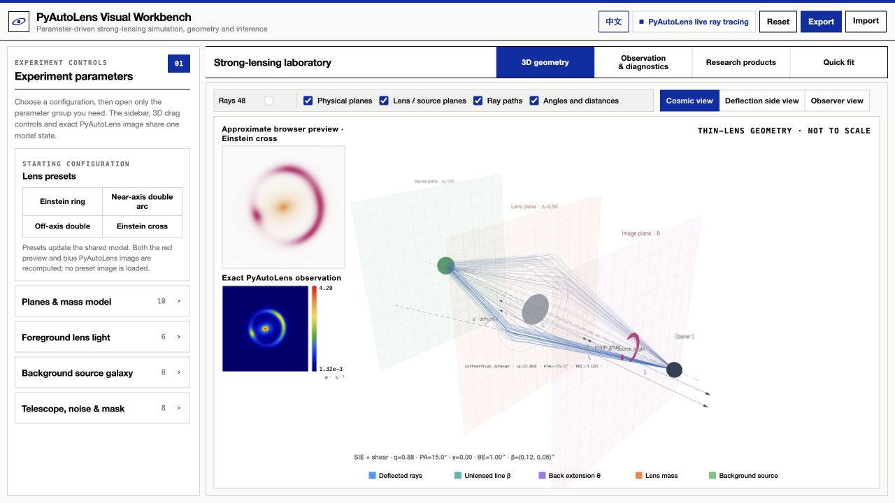

*The home screen shares one model between the sidebar, draggable 3D source, browser preview and PyAutoLens numerical image.*

- Three camera views: cosmic perspective, deflection side view, and observer view.
- Adjust ray density and toggle physical planes, lens / source planes, ray paths, and angle / distance annotations.
- Drag the background source to update the shared parameters and scientific images.
- Compare a responsive browser approximation with a numerical image calculated by local PyAutoLens. The last calculated image remains visible while an update is pending.
- Start with four configurations: **Einstein ring, near-axis double arcs, off-axis double images, and Einstein cross**. Each preset sets model parameters and triggers a fresh calculation.


#### Redshift and camera comparisons

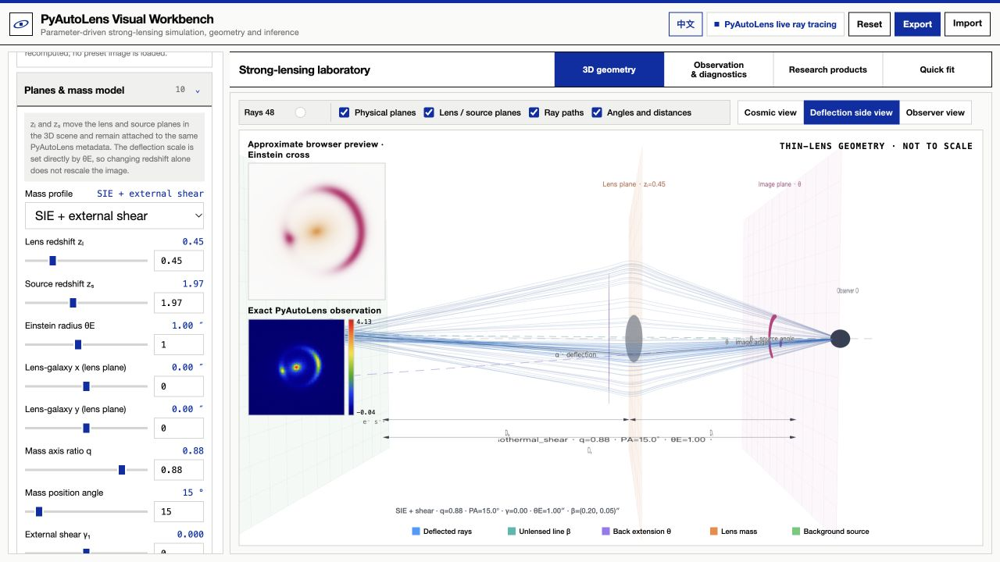

*Deflection side view: zₗ = 0.45, zₛ = 1.97.*

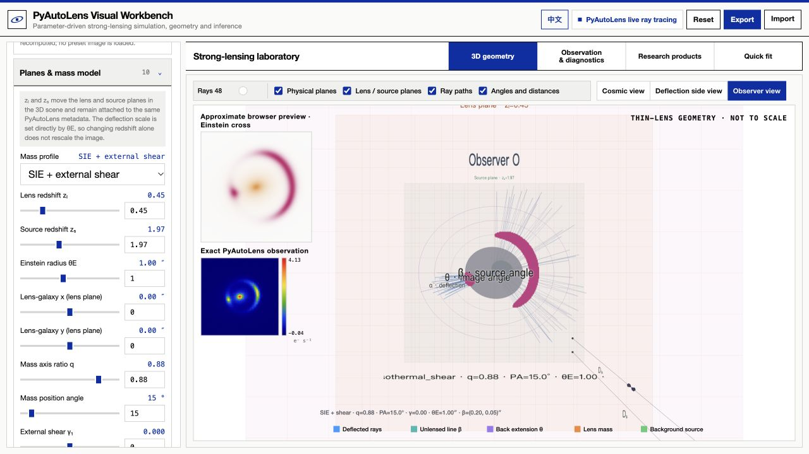

*Observer view of the same configuration.*

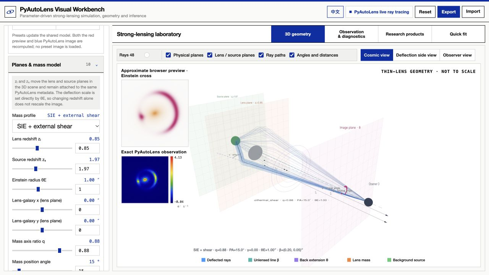

*Cosmic view: zₗ = 0.85, zₛ = 1.97.*

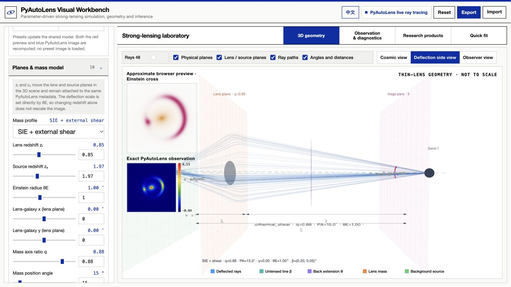

*Side-view comparison: the lens plane moves.*

The home screenshot exposes the actual redshift, Einstein-radius, lens-position and mass-shape sliders. The comparisons hold θE = 1.00″, source position and mass shape fixed. Redshifts move the illustrative planes and are passed to PyAutoLens galaxy metadata; they do not infer a new physical-mass normalization. Ray paths and plane distances are teaching illustrations, not cosmologically scaled distances.

### 2. Parameter-driven forward simulation

32 controls are organized into four expandable groups:

| Group | Controls |
| --- | --- |
| Planes & mass model | Lens / source redshifts, SIS / SIE / SIE with external shear, lens centre, Einstein radius, mass axis ratio and position angle, shear components |
| Foreground lens light | Enable lens light, intensity, effective radius, Sérsic index, axis ratio and position angle |
| Background source | Source model, position, intensity, effective radius, Sérsic index, axis ratio and position angle |
| Telescope, noise & mask | Image sampling, pixel scale, Gaussian PSF, exposure, sky background, Poisson noise, random seed and circular mask |

The browser previews changes while you drag. After interaction, the Python backend recalculates the model using PyAutoLens `Tracer`. Scientific images come from the current model parameters.

### 3. Observation and diagnostics

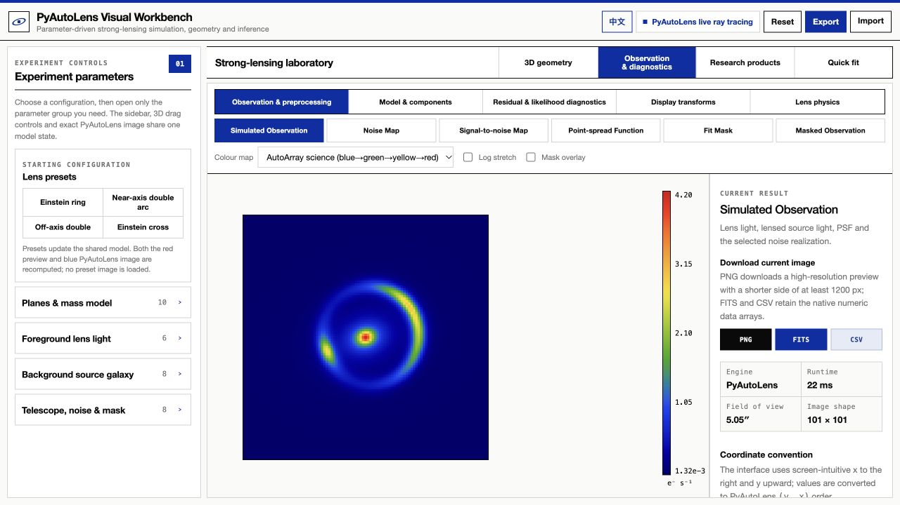

Inspect a selected product at a larger scale, switch scientific colourmaps, add logarithmic stretch or a mask overlay, and export the current image. The sidebar reports the engine, image sampling and field of view. Enable Poisson noise to explore how simulated data differ from their generating model.

### 4. 31 scientific products

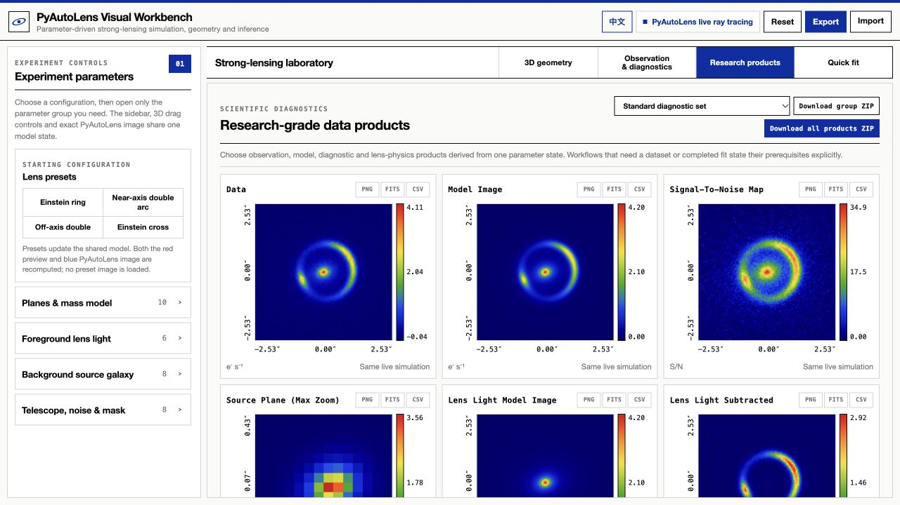

*The standard diagnostic group compares data, model components, source views and residual statistics. This screenshot has Poisson noise enabled; non-zero residuals are expected.*

| Category | Count | Products |
| --- | ---: | --- |
| Observation & preprocessing | 6 | Simulated observation, noise, signal-to-noise, PSF, fitting mask, masked observation |
| Model & components | 8 | PSF-convolved model, unconvolved ideal model, convolved / unconvolved lens light, convolved / unconvolved lensed source, source-plane brightness, lens-light-subtracted data |
| Residual & likelihood diagnostics | 4 | Residuals, normalized residuals, per-pixel χ², residual flux fraction |
| Display transforms | 1 | Log₁₀ model |
| Lens physics | 12 | Convergence κ, potential ψ, x / y deflections and magnitude, shear γ₁ / γ₂ and magnitude, signed magnification μ, Jacobian determinant, tangential / radial eigenvalues |

Browse a standard 12-image panel or the five categories. Products are requested as needed by the current view. Scientific plots include coordinates, numerical colourbars and units, using the installed PyAutoArray colourmap. Calculations also provide critical-curve and caustic overlay data.


#### Product gallery

Expand each group to inspect the actual interface screenshots. Together these views cover all five categories, beyond the standard panel.

<details>
<summary>Standard diagnostics: lower six panels</summary>

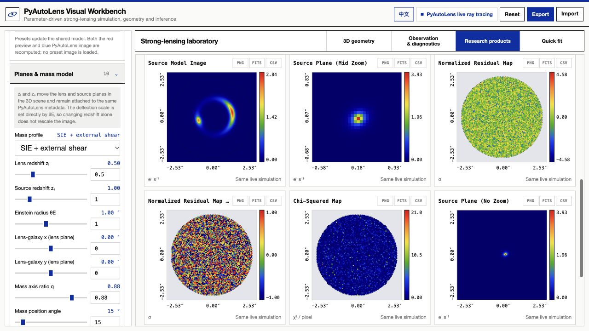

Lensed source, source-plane zooms, normalized residuals and χ² complement the first six panels.

</details>

<details>
<summary>Observation and preprocessing</summary>

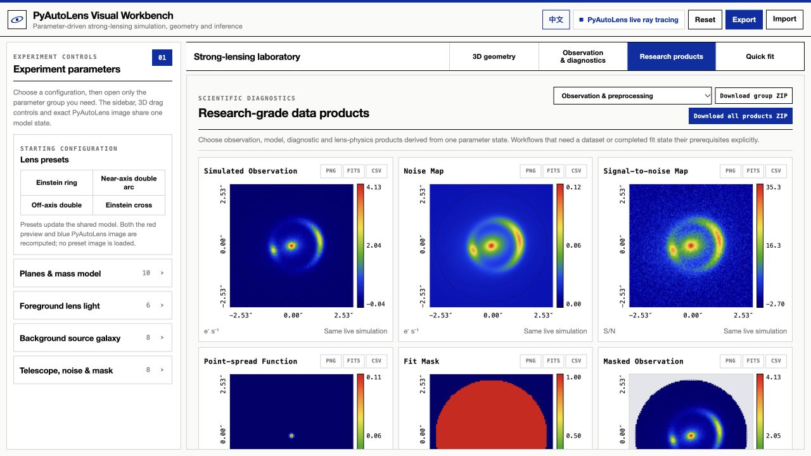

Simulated observation, noise and signal-to-noise describe the mock measurement.

</details>

<details>
<summary>PSF, mask and masked observation</summary>

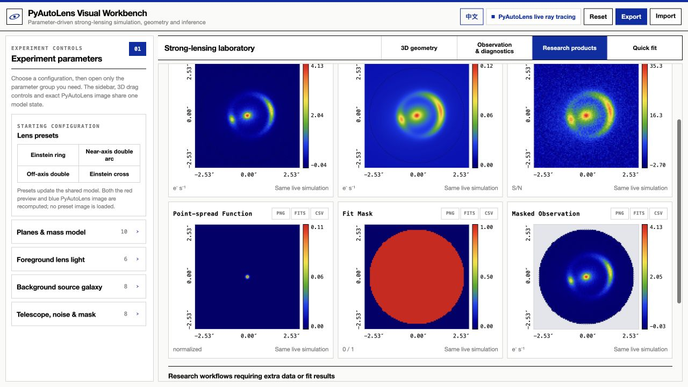

The Gaussian PSF represents image blur; the circular mask selects pixels used by the teaching fit.

</details>

<details>
<summary>Model and components</summary>

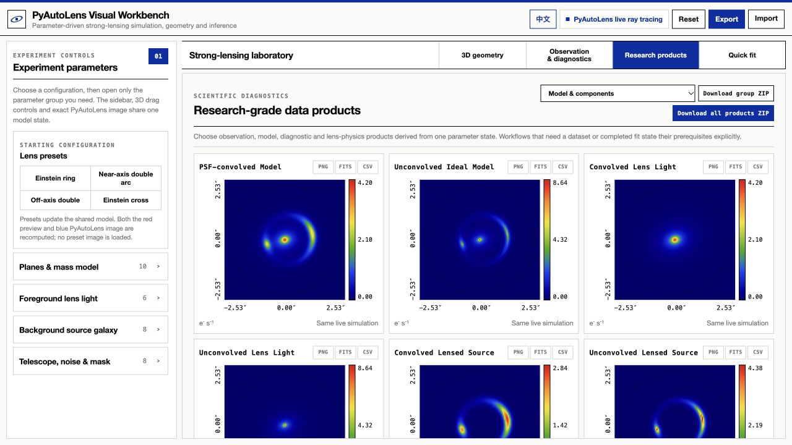

Compare the ideal model with the PSF-convolved image and foreground lens light.

</details>

<details>
<summary>Source and lens-light decomposition</summary>

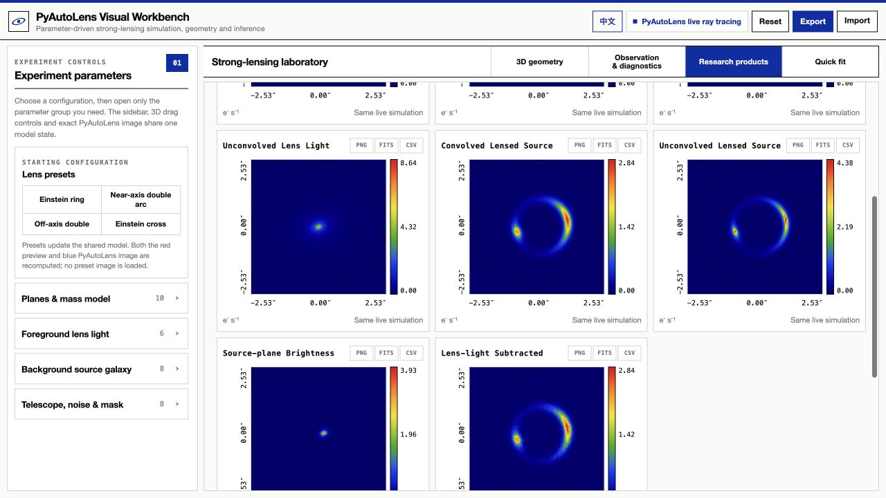

Inspect convolved and unconvolved lensed source, source-plane brightness, and lens-light-subtracted data.

</details>

<details>
<summary>Residual and likelihood diagnostics</summary>

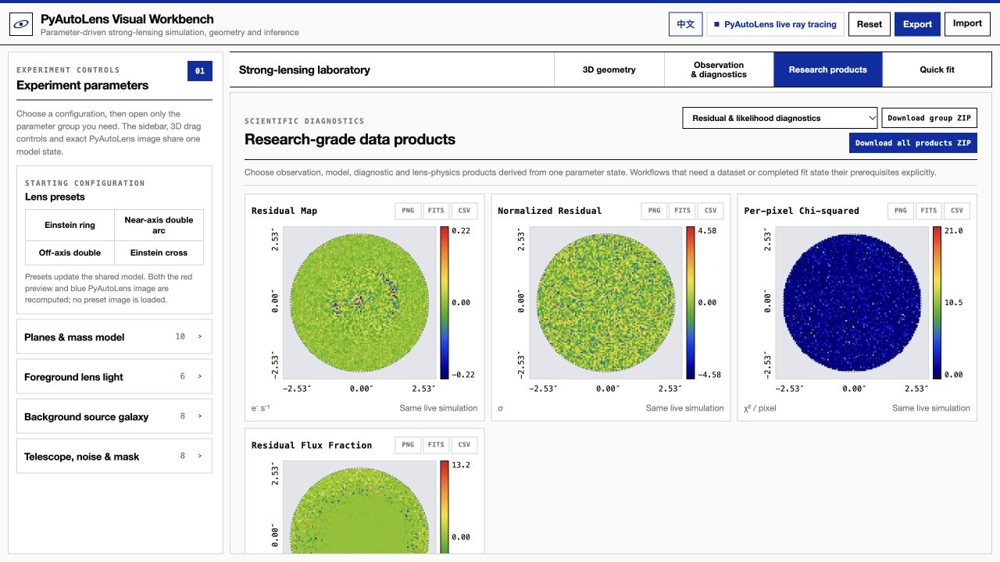

Residuals, normalized residuals, per-pixel χ² and residual flux fraction use the same noisy simulated observation. Non-zero residuals here are generated noise, not evidence of a completed research fit.

</details>

<details>
<summary>Logarithmic display</summary>

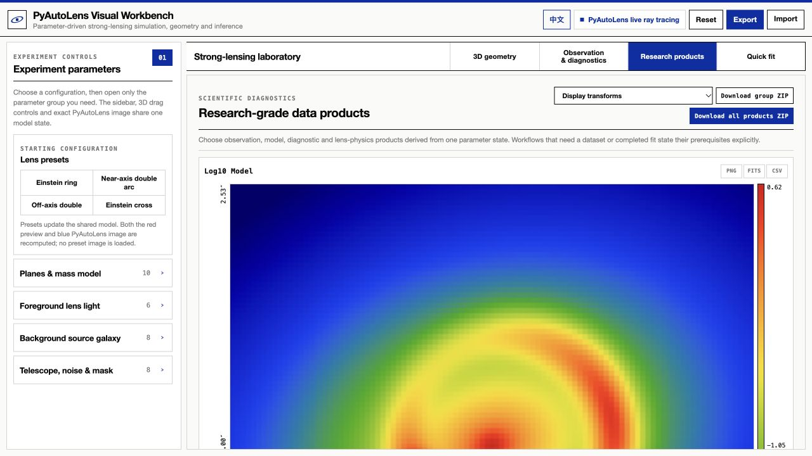

The log model makes faint extended structure easier to inspect; it is a display transform of the same model.

</details>

<details>
<summary>Lens physics: convergence, potential and deflections</summary>

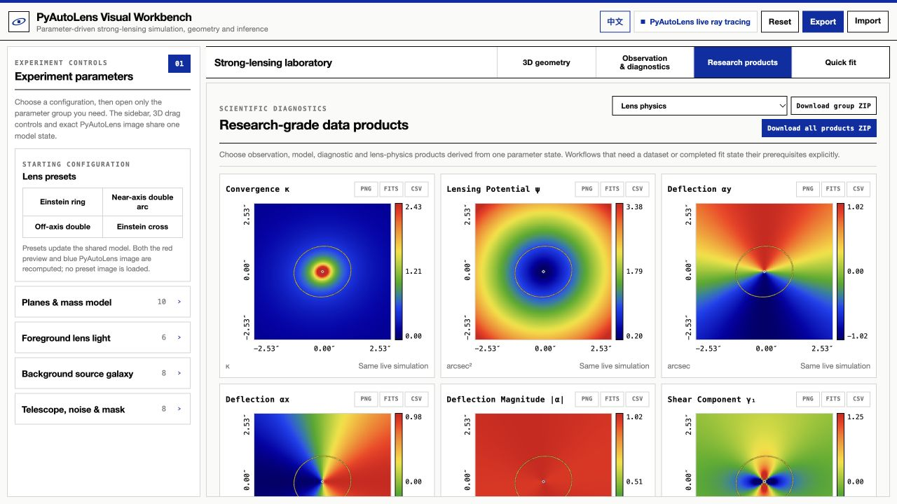

κ traces projected lensing strength; ψ and α describe the potential and deflection field.

</details>

<details>
<summary>Lens physics: deflection and shear</summary>

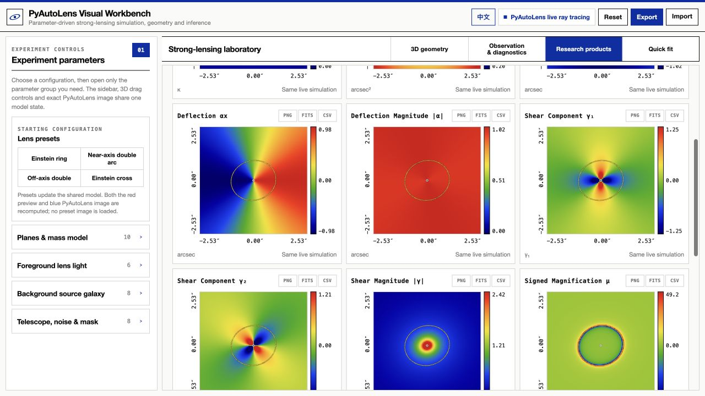

Deflection magnitude and shear components reveal how the lens mapping varies across the field.

</details>

<details>
<summary>Lens physics: magnification and Jacobian</summary>

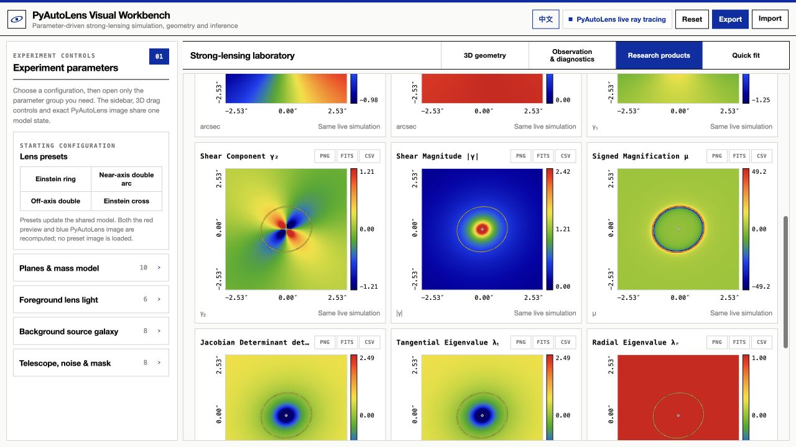

Signed magnification, Jacobian determinant and tangential/radial eigenvalues describe image parity and the local mapping near critical regions.

</details>

### 5. Export and reproduce experiments

- **Individual PNG:** a high-resolution visual preview.
- **Individual FITS / CSV:** native backend `float64` arrays for Python and astronomical data tools.
- **Current-group / complete ZIP:** PNGs, FITS arrays, parameter snapshots, a manifest, calculation summary, point-image results, and critical-curve / caustic overlays.
- **Parameter JSON import / export:** save a configuration and rerun it on another computer.
- **Fixed noise seed:** repeat the same simulated-observation experiment.

FITS / CSV exports use numerical arrays. Preview dimensions and display colourmaps do not change the native data.

### 6. Teaching-oriented quick fitting

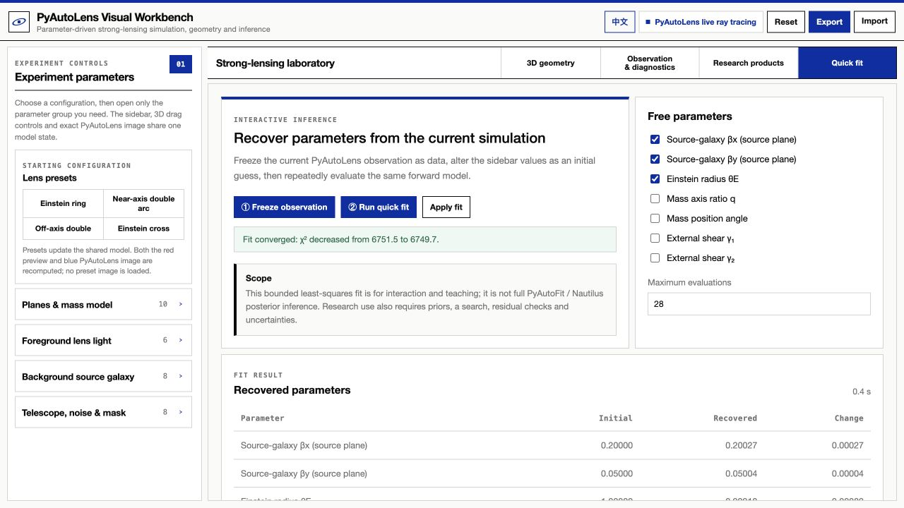

*An actual local fit to a noisy simulated observation. The convergence status and initial / recovered values are shown; this example does not provide posterior credible intervals.*

Freeze the current simulated observation, select 1–5 parameters, and run SciPy bounded least squares against the PyAutoLens forward model. Compare initial and recovered values and inspect the fitted model, residuals, normalized residuals and χ².

This demonstrates parameter recovery and model sensitivity. The interface does not currently provide a complete prior editor, posterior sampling workflow, or credible intervals.

## Installation and launch

### Requirements

- **Python 3.12 or newer**; start with the validated Python 3.12 configuration where possible.
- macOS or Windows, a modern desktop browser; a window width of at least 1280 pixels is recommended.
- Internet access for the first dependency installation. No Node.js, npm, or frontend build step is required.
- `requirements.txt` pins `autolens==2026.9.15.1`. Other dependencies use version ranges, so future installations may resolve different combinations.

Download [v1.0.0](https://github.com/SiriusFzh/PyAutoLens-Workbench/releases/tag/v1.0.0) for the same macOS / Windows source bundle, or use **Code → Download ZIP**. Extract before launching.

### Get the source

Use **Code → Download ZIP** on this repository and extract it, or:

```bash
git clone https://github.com/SiriusFzh/PyAutoLens-Workbench.git
cd PyAutoLens-Workbench
```

### macOS

Double-click `workbench/START_MAC.command`. The first launch creates `workbench/.venv`, installs dependencies and opens the browser.

Alternatively, from the repository directory:

```bash
bash workbench/START_MAC.command
```

If the file does not have executable permission:

```bash
chmod +x workbench/START_MAC.command
bash workbench/START_MAC.command
```

### Windows

Install Python 3.12 with the Python Launcher, then double-click `workbench/START_WINDOWS.cmd`.

Both platform shortcuts call the same `start.py`. It creates a local `.venv`, installs dependencies and retries on the next launch if installation was interrupted. There is one application and one cross-platform download.

### Manual setup

macOS:

```bash
cd workbench
python3.12 -m venv .venv
.venv/bin/python -m pip install --upgrade pip
.venv/bin/python -m pip install -r requirements.txt
.venv/bin/python server.py
```

Windows PowerShell:

```powershell
cd workbench
py -3.12 -m venv .venv
.\.venv\Scripts\python.exe -m pip install --upgrade pip
.\.venv\Scripts\python.exe -m pip install -r requirements.txt
.\.venv\Scripts\python.exe server.py
```

The usual address is `http://127.0.0.1:8765/`. If occupied, the server selects an available port between 8765 and 8795; use the address printed in the terminal. Keep the launch window running and press **Ctrl+C** to stop it. Use **EN / 中文** at the top right to switch the interface language. First visits default to English; choosing Chinese saves that preference in your browser.

### A five-minute experiment

1. Select the Einstein-ring preset and inspect the near-axis configuration.
2. Drag the source or change `source_x` / `source_y` to compare rings, arcs and multiple images.
3. Change θE, mass axis ratio or shear to inspect the image geometry and critical curves.
4. Open Observation & diagnostics, enable Poisson noise, and compare data, model and normalized residuals.
5. Inspect magnification and deflections in the product library, then download FITS or CSV data.
6. Export the parameter JSON; optionally freeze the simulated observation and try a quick fit.

## Scientific assumptions and current scope

- **Implemented:** parametric thin-lens forward simulations and teaching least-squares fits to simulated data.
- **Not yet integrated into a complete interface:** real FITS-data import, measured PSF / noise maps, full `FitImaging` analysis, PyAutoFit / Nautilus posteriors, pixelized source inversions, interferometric visibilities, formal point-source / time-delay analysis, joint multi-band fits, and substructure sensitivity mapping.
- Capability metadata distinguishes workflows that need data, need a completed fit, or lack an adapter. `is_full_pyautolens_frontend` is `false`.
- Smooth 3D rays and plane distances are teaching illustrations and are not drawn to cosmological scale. The browser preview and PyAutoLens numerical image have different accuracy.
- **θE is an explicit angular input:** redshift controls update planes and galaxy metadata. At fixed θE, changing redshift alone does not infer a new deflection scale from a physical mass.
- The observing layer uses the workbench's Gaussian PSF implementation and simulated noise / exposure conditions.
- With Poisson noise disabled, data and the generating model match, so residuals and χ² are near zero. Actual model-fit quality requires a fitting workflow and independent data.
- Scientific colours are quantitative false colours. Magnification can become very large near critical curves; residual flux fractions require care at low signal-to-noise.

## Architecture and local API

```text
PyAutoLens-Workbench/
├── README.md / README.zh-CN.md       Bilingual project documentation
├── LICENSE / THIRD_PARTY_NOTICES.md
├── docs/screenshots/             README screenshots; not required at runtime
├── start.py                      Shared cross-platform launcher
├── lessons/                      3D teaching scene
└── workbench/
    ├── START_MAC.command / START_WINDOWS.cmd
    ├── requirements.txt
    ├── server.py                 Localhost HTTP service
    ├── lensing_engine.py         Validation, Tracer, forward models and quick fits
    ├── product_registry.py       Products, categories, units and availability
    ├── product_export.py         PNG / FITS / CSV / ZIP exports
    ├── capability_registry.py    Capability metadata
    ├── build_portable.py         Portable source ZIP builder
    └── static/                   HTML / CSS / JavaScript / Three.js
```

| Method and path | Purpose |
| --- | --- |
| `GET /api/health` | Engine and teaching-page availability |
| `GET /api/defaults` | Default parameters |
| `GET /api/capabilities` | Exposed capabilities and scientific scope |
| `GET /api/catalog` | Products, categories and workflow availability |
| `GET /api/colormap` | Scientific colourmap |
| `POST /api/simulate` | Compute all or selected products |
| `POST /api/fit` | Teaching quick fit |
| `POST /api/export/product` | Export one product |
| `POST /api/export/bundle` | Export a product ZIP |

Example: request only the observation and magnification after starting the service:

```bash
curl http://127.0.0.1:8765/api/simulate \
  -H 'Content-Type: application/json' \
  -d '{"config":{"source_x":0.12,"source_y":0.05},"requested_products":["observed","magnification"]}'
```

The server binds only to `127.0.0.1`. The application has no workflow that uploads scientific parameters or images. Initial pip installation accesses package servers. Opening the teaching HTML directly may request external scripts; the workbench server rewrites Three.js imports to bundled local assets.

Use `python server.py --no-browser` during development, or `python server.py --port 8766` for a fixed port. Build a shareable source archive with:

```bash
cd workbench
python build_portable.py
```

The result goes to `deliverables/` and excludes Python environments, caches and optional local fonts.

## Validation and troubleshooting

On 2026-10-06, installation and launch were checked on a physical Apple Silicon Mac with Python 3.12. The English default, Chinese switching and saved preferences were inspected in the main UI and 3D scene. All 31 products, noisy simulation and PNG / FITS / CSV / ZIP exports were verified. The supplied portable bundle records earlier Windows + Edge verification; Windows was not rerun during this publication preparation. This is launch and functional verification; research applications still require suitable scientific accuracy assessment.

- **Wrong Python version:** check `python3.12 --version` on Mac or `py -3.12 --version` on Windows. macOS system Python 3.9 is insufficient.
- **Slow or interrupted dependency installation:** rerun the virtual environment's Python with `-m pip install -r requirements.txt` in `workbench`, then launch again. The shared launcher retries an unfinished installation automatically; manual pip installation is also available.
- **No browser opens:** copy the localhost address printed by the terminal.
- **Calculation fails:** inspect the server terminal, parameter values and dependency versions. Check that the local virtual environment matches the listed requirements.
- **Blank 3D view:** check WebGL / hardware acceleration and try a modern desktop browser.
- **Offline use:** install dependencies while online, then launch through `server.py`. Opening static HTML alone does not provide the Python calculation API.

## Upstream project, acknowledgements and citation

This workbench builds on open-source [**PyAutoLens**](https://github.com/PyAutoLabs/PyAutoLens). Thank you to James Nightingale and the PyAutoLabs developers, researchers and contributors. PyAutoLens supplies strong-lensing modeling capabilities; this project supplies desktop-browser interaction, a 3D teaching view, parameter controls, product browsing and export tools.

- [PyAutoLens repository](https://github.com/PyAutoLabs/PyAutoLens)
- [Official documentation](https://pyautolens.readthedocs.io/)
- [Example workspace](https://github.com/PyAutoLabs/autolens_workspace)
- [HowToLens tutorials](https://github.com/PyAutoLabs/HowToLens)
- [Official citation guidance](https://pyautolens.readthedocs.io/en/latest/general/citations.html)
- [PyAutoLabs community discussions](https://github.com/orgs/PyAutoLabs/discussions)

For research using PyAutoLens, follow its official guidance and cite the relevant papers. A repository attribution link does not replace academic citation. The main software paper is Nightingale et al. (2021), *PyAutoLens: Open-Source Strong Gravitational Lensing*, JOSS 6(58), 2825, [DOI: 10.21105/joss.02825](https://doi.org/10.21105/joss.02825). If you use this workbench, a link to this repository in your methods is also welcome.

## Contributing and license

Usage reports, scientific feedback, translations and focused pull requests are welcome. Include the OS, Python / dependency versions, reproduction steps, parameter JSON and error messages in bug reports. For a new scientific workflow, describe its input data, physical assumptions, validation plan and corresponding PyAutoLens APIs first.

Original workbench code is released under the [MIT License](LICENSE), credited to SiriusFzh. Third-party components retain their own licenses; see [third-party notices](THIRD_PARTY_NOTICES.md). The GitHub distribution uses system fonts and does not redistribute the separately licensed Satoshi / MiSans fonts from the supplied portable bundle. The project is listed in the official community directory and independently maintained by SiriusFzh.
